# Documentacion de Arquitectura y Flujos - Gym APP

Bienvenido a la documentacion visual del sistema Gym APP. En este documento se encuentran los diagramas UML que definen la arquitectura, las bases de datos y la logica de negocio de la aplicacion.

---

## 1. Arquitectura y Estructura del Sistema

### Casos de Uso
Define que acciones puede realizar cada tipo de usuario en el sistema.

### Diagramas de Clases
Muestra la estructura de los datos, la conexion con la base de datos y los controladores.
* **Modelos y Dominio:**
  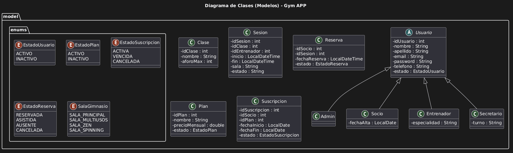
* **Capa de Acceso a Datos (DAO):**
  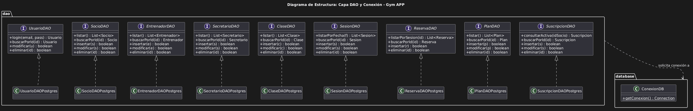
* **Controladores y Utilidades:**
  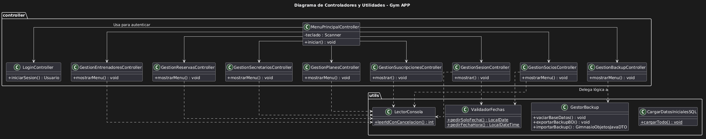

---

## 2. Ciclo de Vida (Diagramas de Estados)

Muestra cómo cambian de estado las entidades principales a lo largo del tiempo.
* **Estado de una Reserva:**
  
* **Estado de una Suscripcion:**
  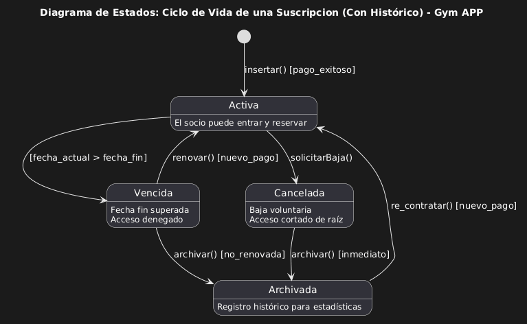

---

## 3. Flujos de Trabajo (Diagramas de Actividad)

### Autenticacion y Gestion de Usuarios
* **Inicio de Sesion (Login):**
  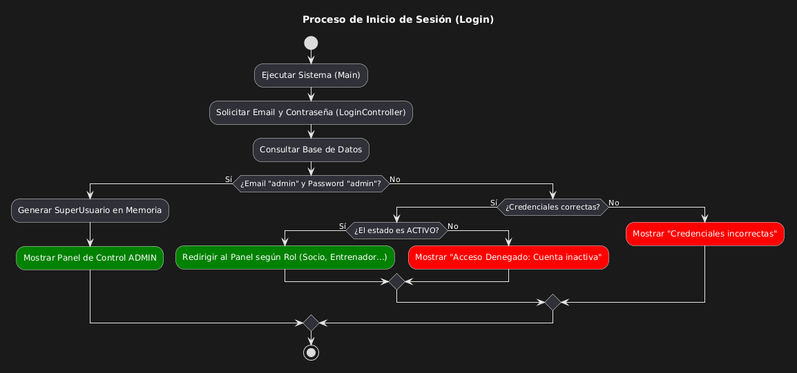
* **Alta de Usuario:**
  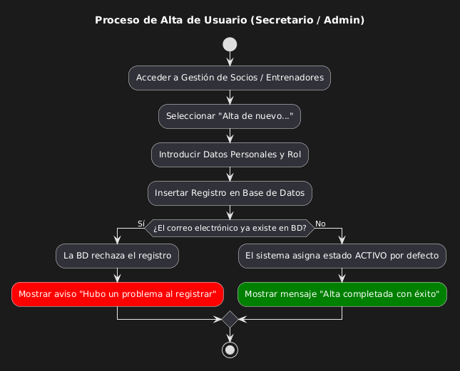

### Planes y Suscripciones
* **Administrar Planes:**
  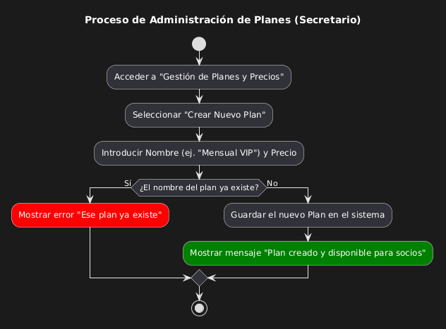
* **Vender Suscripcion:**
  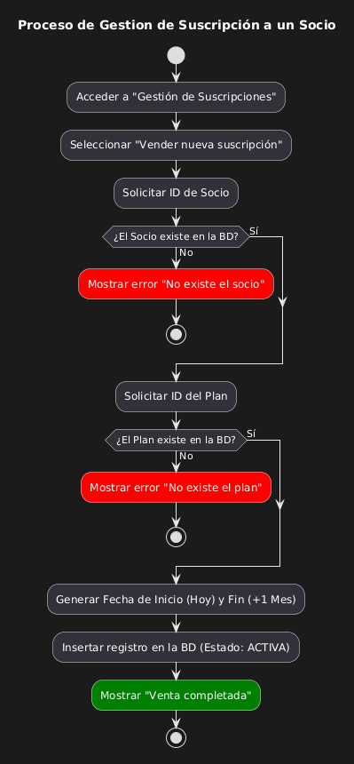

### Gestion de Sesiones y Reservas
* **Programar Sesion:**
  
* **Anadir Clase al Catalogo:**
  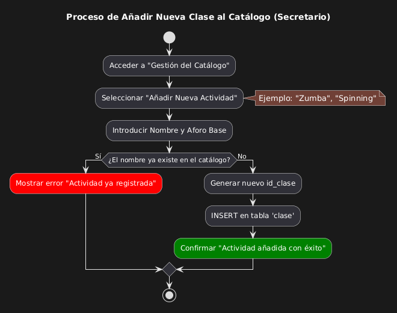
* **Reserva de Sesion:**
  
* **Consultar Asistencia:**
  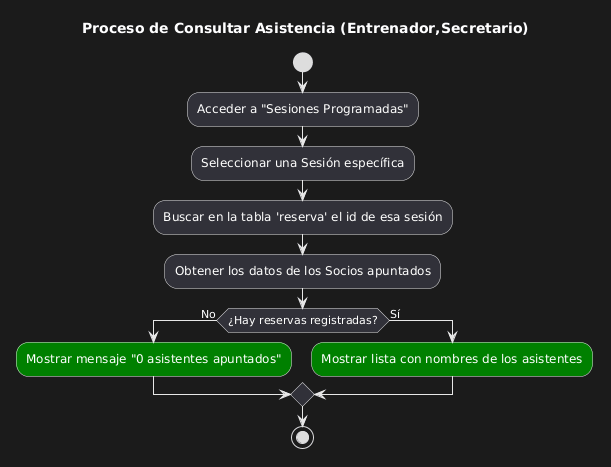

### Cancelaciones y Seguridad
* **Cancelar Sesion:**
  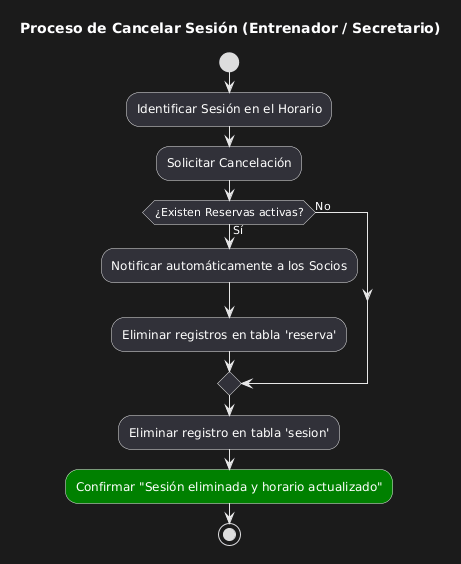
* **Cancelar Reserva:**
  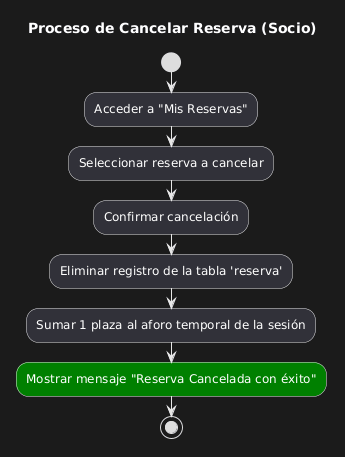

### Mantenimiento del Sistema
* **Exportar Copia de Seguridad:**
  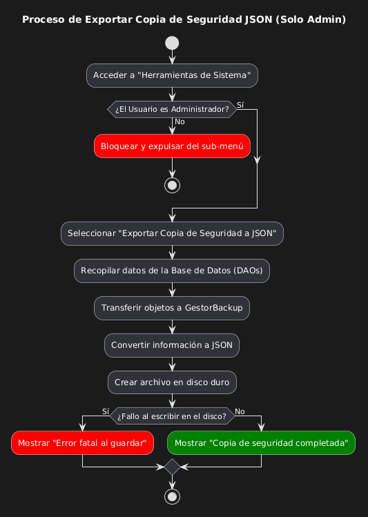
* **Restaurar Copia de Seguridad:**
  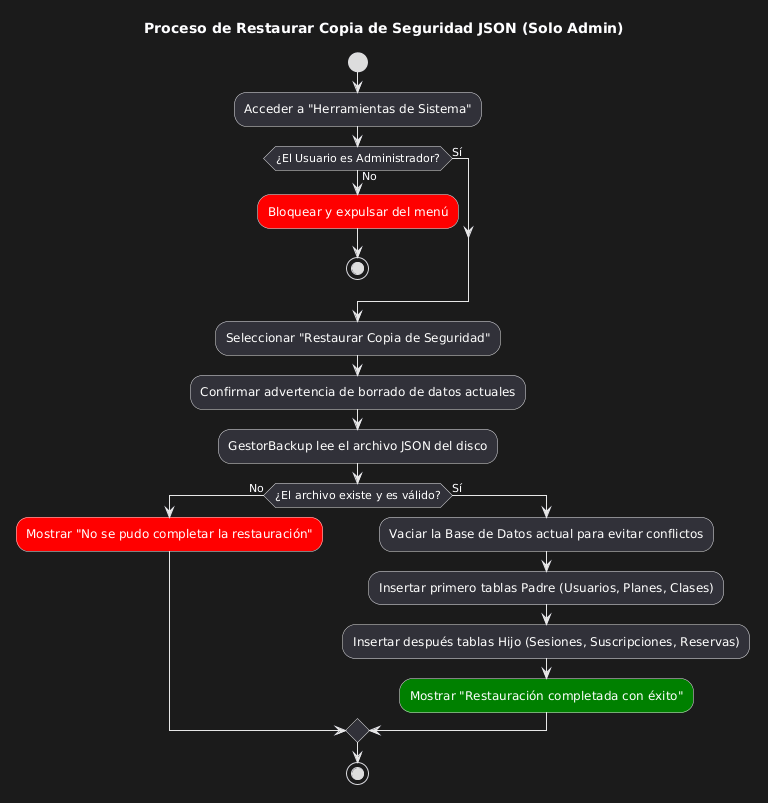

---

## 4. Interaccion entre Objetos (Diagramas de Secuencia)

Estos diagramas muestran el orden cronológico de los mensajes que se envían las clases (Vista -> Controlador -> DAO -> BD) para ejecutar una acción.

### Usuarios y Autenticacion
* **Iniciar Sesion (Login):**
  .png)
* **Alta de Usuario:**
  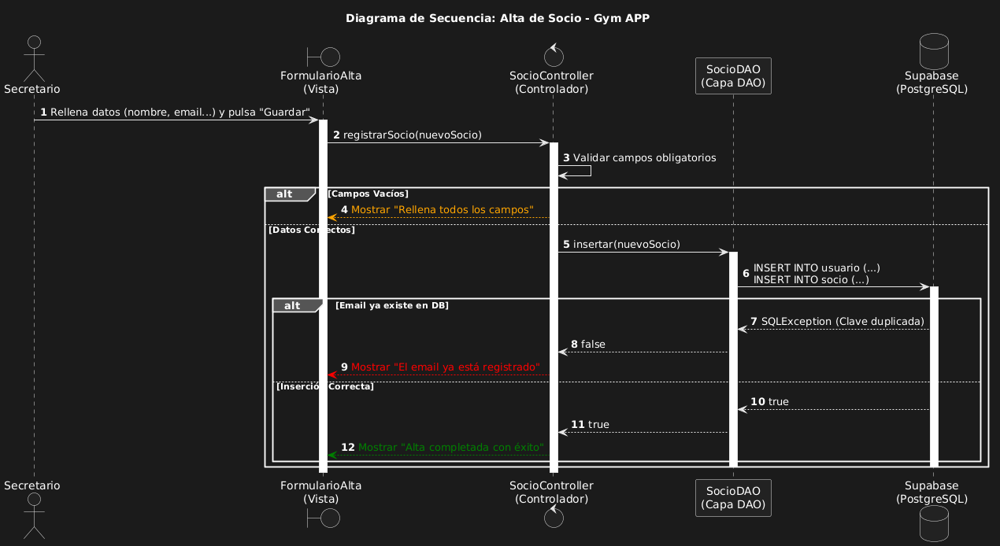

### Operaciones Core
* **Crear un Plan:**
  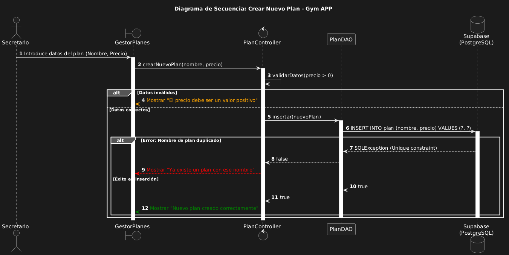
* **Gestionar Suscripcion:**
  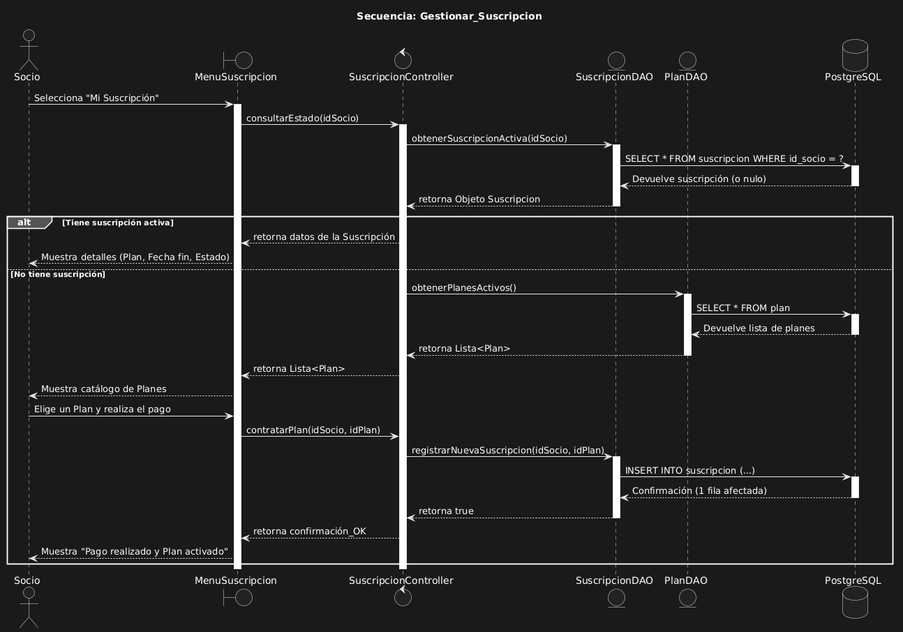
* **Programar Sesion:**
  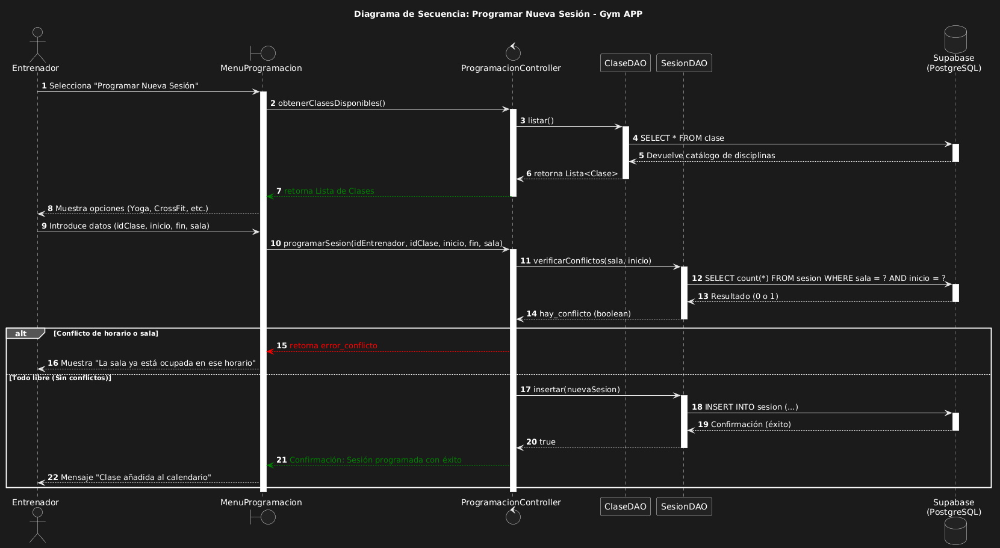
* **Reservar Sesion:**
  
* **Consultar Asistencia:**
  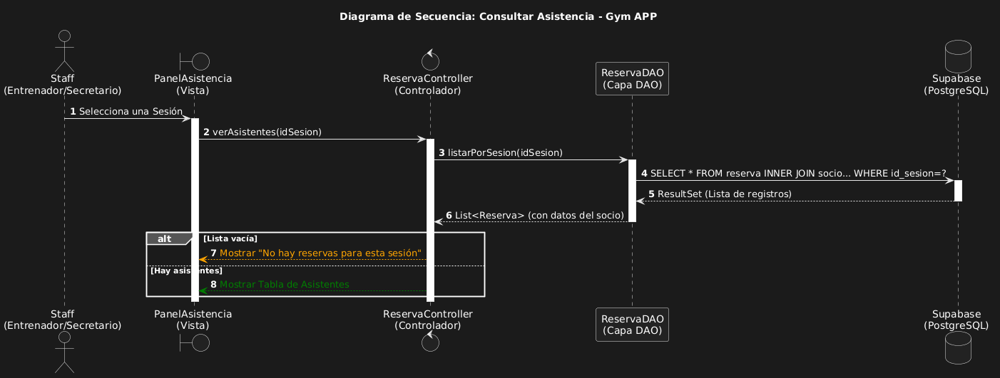

### Cancelaciones y Mantenimiento
* **Cancelar Sesion:**
  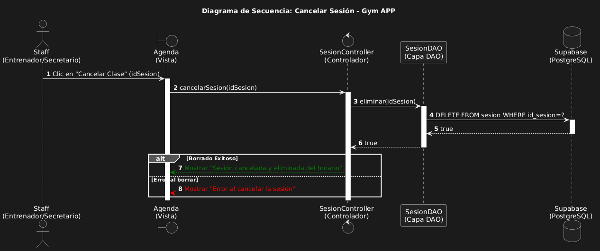
* **Cancelar Reserva:**
  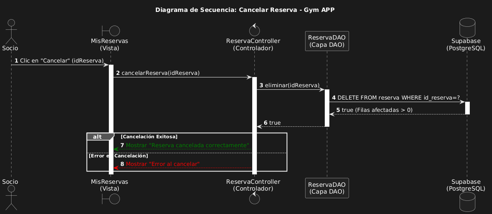
* **Generar Copia de Seguridad (JSON):**
  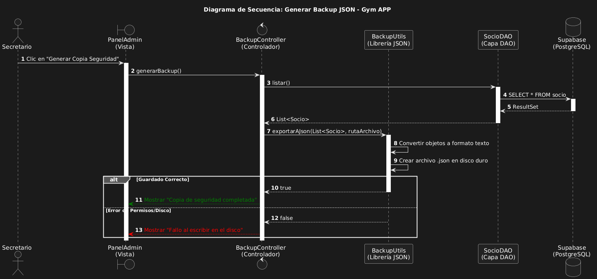