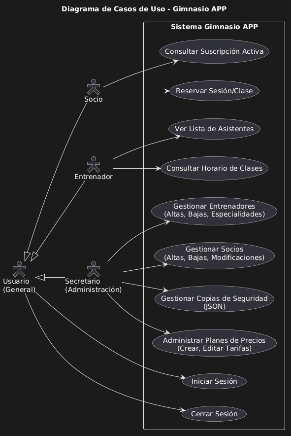
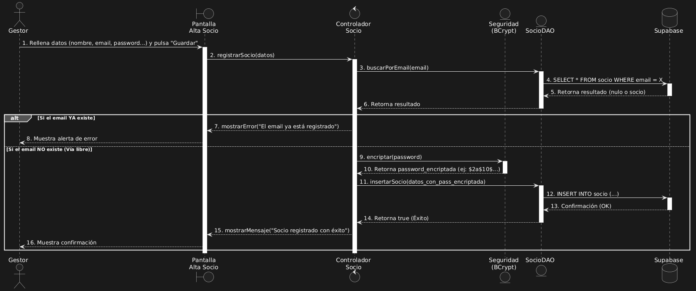
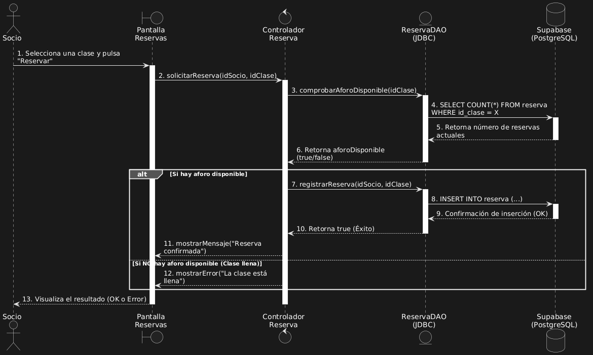
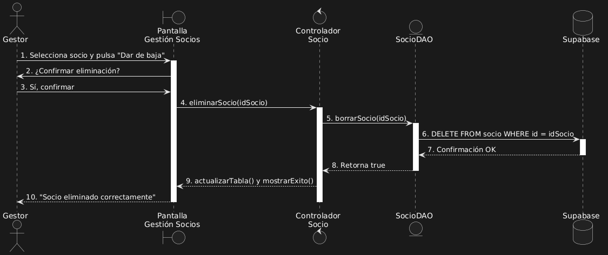
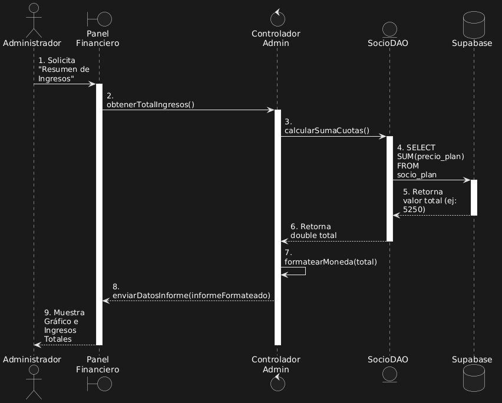
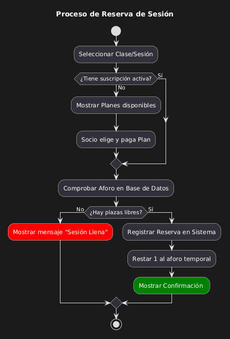
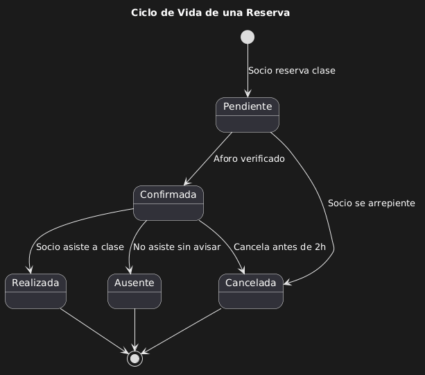

# Documentación de Comportamiento del Sistema (UML)

En esta sección se detallan los diagramas de comportamiento del Sistema de Gestión de Gimnasio, siguiendo el estándar UML para definir la lógica, las interacciones y el ciclo de vida de las entidades.

## 1. Diagrama de Casos de Uso
Define las funcionalidades del sistema desde el punto de vista de los diferentes actores (Socio, Entrenador, Gestor y Administrador).

---

## 2. Diagramas de Secuencia
Representan la interacción entre los objetos del sistema (Controladores, DAOs, Base de Datos) en un orden temporal para los procesos críticos.

### Registro de Nuevo Socio (Seguridad y Validación)
Muestra el proceso de alta, incluyendo la encriptación de contraseñas con BCrypt y validación de emails.

### Gestión de Reservas
Proceso de reserva de plaza con comprobación de aforo en tiempo real.

### Baja de Socio
Flujo de eliminación de registros con paso de confirmación previo.

### Generación de Informes Financieros
Muestra cómo el sistema procesa datos de la base de datos para ofrecer métricas al Administrador.

---

## 3. Diagrama de Actividades
Representa el flujo lógico y los caminos de decisión (algoritmos) del proceso de reserva, incluyendo el control de errores (clase llena).

---

## 4. Diagrama de Estados
Define la evolución y el ciclo de vida de una **Reserva** dentro del sistema, desde que se solicita hasta que se completa o cancela.

---

## Herramientas utilizadas
- **PlantUML**: Para la generación de diagramas mediante código.
- **VS Code / IntelliJ**: Editores para la gestión de archivos `.puml`.