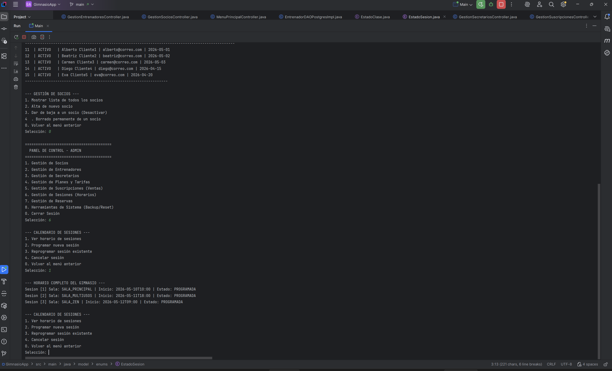
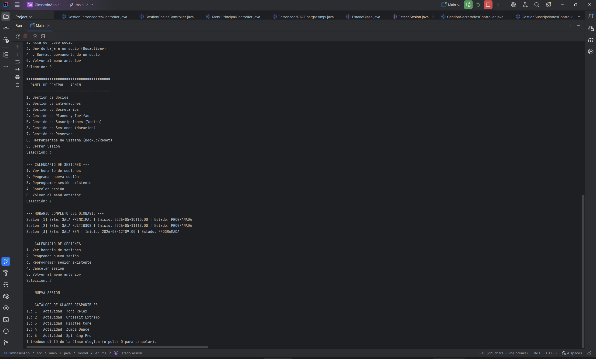

# Portfolio Profesional: GimnasioApp

## 1. El Proyecto: Gestión Integral de Centros Deportivos
**GimnasioApp** es una solución de escritorio desarrollada en Java que centraliza la administración de socios, entrenadores y planes de entrenamiento. El sistema utiliza una base de datos PostgreSQL en la nube (Supabase) para garantizar que la información esté siempre disponible y segura.

### Problema y Solución
- **El reto**: Muchos centros pequeños dependen de hojas de cálculo propensas a errores de duplicidad[cite: 1].
- **La solución**: Una interfaz intuitiva conectada a una base de datos relacional que valida cada entrada mediante lógica de negocio y esquemas XML/XSD[cite: 1].

## 2. Capturas de Pantalla

- 
- 
- 

## 3. Explicación Técnica
El proyecto se divide en tres capas fundamentales que demuestran las competencias adquiridas en el primer año de DAM:
- **Capa de Datos**: Diseño de modelo Entidad-Relación y tablas en PostgreSQL[cite: 1].
- **Capa de Lógica**: Implementación en Java con conexión JDBC y manejo de excepciones para procesos CRUD[cite: 1].
- **Capa de Intercambio**: Generación de informes en XML validados por esquemas XSD[cite: 1].

## 4. Aprendizajes Clave
Durante el desarrollo de **GimnasioApp**, he adquirido habilidades críticas para el perfil de desarrollador:
- **Integración de sistemas**: Conectar una aplicación local con servicios en la nube como Supabase[cite: 1].
- **Gestión de versiones**: Uso profesional de Git y GitHub para mantener un flujo de trabajo ordenado[cite: 1].
- **Mentalidad Backend**: Entender que la seguridad y la integridad de los datos son la base de cualquier software profesional[cite: 1].
- **Resolución de problemas**: Capacidad para depurar errores de conexión y adaptar la lógica a las restricciones de la base de datos[cite: 1].

## 5. Repositorio de Código
Puedes revisar el código fuente completo, los scripts SQL y la documentación técnica en el siguiente enlace:

🔗 **Enlace al repositorio**: [https://github.com/FerminGarridoMartinDAM/ProyectoInterModular1DAMAppGimnasio]
🔗 **Enlace al perfil GitHub**: [https://github.com/FerminGarridoMartinDAM]

---
*Este documento forma parte del entregable de Itinerario Personal para la Empleabilidad I - Proyecto Intermodular 1º DAM.*