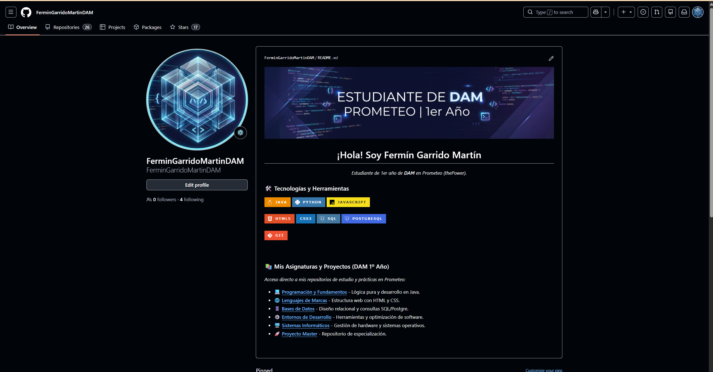

# DOSSIER PROFESIONAL: GIMNASIOAPP

**Proyecto:** Intermodular 1º DAM  
**Estudiante:** Fermín Garrido Martín  
**Institución:** Prometeo The PowerMBA

---

##  Índice
1. [Perfil Profesional](#1-perfil-profesional)
   - [Sobre mí](#sobre-mí)
   - [Stack Tecnológico](#stack-tecnológico)
2. [Exploración del Sector Profesional](#2-exploración-del-sector-profesional)
   - [Análisis de Empresas](#análisis-de-empresas)
   - [Referentes Profesionales](#referentes-profesionales)
3. [Portfolio y Presentación del Proyecto](#3-portfolio-y-presentación-del-proyecto)
   - [Resumen de GimnasioApp](#resumen-de-gimnasioapp)
   - [Evidencias y Repositorio](#evidencias-y-repositorio)
4. [Reflexión Personal](#4-reflexión-personal)
   - [Aprendizajes clave](#aprendizajes-clave)

---

## 1. Perfil Profesional

### Sobre mí

Soy estudiante de primer año del Ciclo Formativo de Grado Superior en Desarrollo de Aplicaciones Multiplataforma (DAM) en Prometeo by ThePower. Mi perfil está claramente orientado al desarrollo Backend y a la arquitectura de sistemas de datos. Me motiva profundamente comprender la lógica interna de las aplicaciones y optimizar el procesamiento de la información para lograr sistemas que sean escalables y robustos.

- **Enlace al perfil GitHub:** [https://github.com/FerminGarridoMartinDAM](https://github.com/FerminGarridoMartinDAM)

### Stack Tecnológico
Basándome en mi formación y en los proyectos gestionados en mi repositorio de GitHub, estas son las tecnologías que manejo:
- **Lenguajes de programación:** Java (Programación Orientada a Objetos), HTML y CSS.
- **Gestión de Bases de Datos:** PostgreSQL, con experiencia en despliegue y administración en la nube mediante Supabase.
- **Herramientas y Entornos:** IntelliJ IDEA, Visual Studio Code y control de versiones profesional con Git y GitHub.

---

## 2. Exploración del Sector Profesional

### Análisis de Empresas
He investigado tres empresas con perfiles técnicos que encajan con mi área de interés:
- **Google:** Referente mundial en infraestructura Cloud e Inteligencia Artificial. Contratan ingenieros de software senior y arquitectos de sistemas que dominen Java, Go y Python.
- **Mercanza:** Consultora especializada en Business Intelligence y gestión de datos. Es un destino ideal para perfiles enfocados en SQL y software de gestión empresarial.
- **Prometeo (ThePower):** Empresa del sector EdTech que desarrolla plataformas de aprendizaje mediante arquitecturas modernas de microservicios.

### Referentes Profesionales
Sigo la trayectoria de estos profesionales para aprender de su metodología:
- **Brais Moure (MoureDev):** Destaca por su dominio del desarrollo multiplataforma y su compromiso con las buenas prácticas y la comunidad Open Source.
- **Nate Gentile:** Referencia clave por su enfoque en el rendimiento del software y su conocimiento sobre la influencia del hardware en la programación.

---

## 3. Portfolio y Presentación del Proyecto

### Resumen de GimnasioApp
GimnasioApp es una aplicación de gestión integral desarrollada para digitalizar la operativa de centros deportivos. El proyecto sustituye métodos obsoletos por un sistema centralizado que garantiza la integridad de los datos.
- **Qué es:** Una herramienta de escritorio para el control total sobre los activos del gimnasio.
- **Problema que resuelve:** Centraliza la gestión de socios, planes y reservas, evitando errores de duplicidad.
- **Ficha Técnica:** Desarrollada en Java, conectada a PostgreSQL (Supabase) mediante JDBC y con soporte para intercambio de datos en XML/XSD.

### Evidencias y Repositorio
- **Enlace al repositorio:** [https://github.com/FerminGarridoMartinDAM/ProyectoInterModular1DAMAppGimnasio](https://github.com/FerminGarridoMartinDAM/ProyectoInterModular1DAMAppGimnasio)
- **Enlace al perfil GitHub:** [https://github.com/FerminGarridoMartinDAM](https://github.com/FerminGarridoMartinDAM)

---

## 4. Reflexión Personal

Desarrollar GimnasioApp ha sido un reto integrador fundamental que me ha permitido conectar los módulos de Programación y Bases de Datos en un entorno real.

### Aprendizajes clave:
- **Integración Técnica:** La gestión de datos en la nube ha sido el aprendizaje más valioso de este año.
- **Planificación:** Trabajar con una fecha límite me ha enseñado a priorizar funciones críticas.
- **Resolución de Problemas:** He mejorado mi capacidad para depurar errores lógicos y adaptar el código ante imprevistos técnicos.

**Visión de futuro:** Mi plan es seguir formándome con la misma intensidad, aprovechando cada proyecto para dominar nuevas herramientas y alcanzar el perfil de experto en Backend que busco.