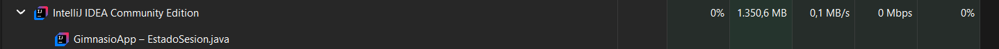
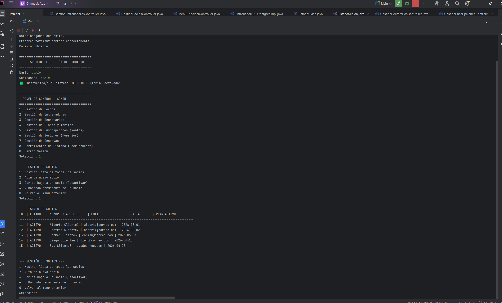

# Informe Técnico del Entorno de Ejecución: GimnasioApp

##  Índice
1. [Tipo de sistema donde se ejecuta](#1-tipo-de-sistema-donde-se-ejecuta)
2. [Requisitos de Hardware](#2-requisitos-de-hardware)
3. [Sistema Operativo Recomendado](#3-sistema-operativo-recomendado)
4. [Guía de Instalación del Entorno](#4-guía-de-instalación-del-entorno)
5. [Usuarios, Permisos y Estructura](#5-usuarios-permisos-y-estructura)
6. [Mantenimiento Básico](#6-mantenimiento-básico)
7. [Evidencias de Funcionamiento](#7-evidencias-de-funcionamiento)
8. [Esquema del Sistema](#8-esquema-del-sistema)

## 1. Tipo de sistema donde se ejecuta
- **Tipo de sistema:** Ordenador de usuario (PC).
- **Justificación:** Como es una aplicación de consola hecha en Java, está pensada para ejecutarse directamente en el ordenador del gimnasio (por ejemplo, en recepción). Además, como la base de datos está alojada en la nube con Supabase, el ordenador local no tiene que almacenar datos ni hacer de servidor, por lo que la infraestructura necesaria es muy sencilla.

## 2. Requisitos de Hardware
Hay que tener en cuenta que, para probar y corregir este proyecto según las instrucciones, la aplicación se ejecuta abriendo el código directamente en un entorno de desarrollo como IntelliJ IDEA. Esto hace que el consumo de memoria sea más alto que si fuera un programa ya compilado de forma independiente.

Teniendo esto en cuenta, y sabiendo que el procesamiento de datos lo hace la base de datos en la nube, los requisitos son los siguientes:

| Componente | Mínimo | Recomendado |
| :--- | :--- | :--- |
| **CPU** | Procesador de 2 núcleos | Procesador de 4 núcleos o superior |
| **RAM** | 4 GB de RAM | 8 GB de RAM (para que IntelliJ y el sistema operativo vayan fluidos al mismo tiempo) |
| **Almacenamiento** | 2 GB libres (para el IDE, Java y los archivos del proyecto) | 5 GB libres |
| **Monitor** | Resolución estándar | Resolución 1920x1080 |
| **Conectividad** | Conexión estable a Internet para trabajar con la base de datos | |

Capturas del consumo de intellij y de Java.

## 3. Sistema Operativo Recomendado
- **Sistema principal:** Windows 10, Windows 11 o cualquier distribución Linux moderna (como Ubuntu).
- **Justificación:** Al estar programado en Java, la aplicación es multiplataforma y funciona en cualquier sitio, por lo que no está atada a un sistema concreto. Sin embargo, recomiendo Windows 10 u 11 porque suele ser el sistema operativo que viene instalado por defecto en la gran mayoría de los ordenadores de los gimnasios (recepción, oficinas), lo que hace que no haya que cambiar de equipo para usarlo.

## 4. Guía de Instalación del Entorno
Como el proyecto está preparado para abrirse y probarse directamente desde el código fuente para su corrección, los pasos a seguir son estos:
1. **Instalar Java:** Descargar e instalar el Java Development Kit (JDK 17 o superior).
2. **Instalar un IDE:** Tener instalado un entorno de desarrollo compatible, preferiblemente IntelliJ IDEA (que es con el que se ha desarrollado) o Visual Studio Code.
3. **Descargar el proyecto:** Clonar el repositorio de GitHub o descargar la carpeta y abrirla desde el IDE.
4. **Dependencias de la Base de Datos:** Asegurarse de que el driver de PostgreSQL (`postgresql-42.x.x.jar`) está correctamente enlazado en el IDE para que la conexión a Supabase funcione.
5. **Ejecutar:** Abrir el archivo `Main.java` y darle a ejecutar.

## 5. Usuarios, Permisos y Estructura
- **Usuarios de la aplicación y permisos:** El sistema está pensado para ser utilizado por diferentes perfiles dentro del gimnasio, cada uno con sus propios permisos:
  - **Administrador:** Tiene acceso total. Puede gestionar todos los usuarios, modificar tarifas, eliminar registros y acceder a todas las funciones críticas.
  - **Secretario/a:** Se encarga de la gestión diaria. Puede dar de alta o baja a socios, modificar sus datos, asignarles planes de precios y gestionar el calendario.
  - **Entrenador:** Tiene un acceso más limitado, enfocado en organizar sus clases, ver los horarios y consultar qué socios están apuntados a sus sesiones.
  - **Socio:** (Si interactúa con el sistema) Solo puede ver sus propios datos, consultar su estado, ver el horario de clases y apuntarse a las sesiones.
- **Estructura del proyecto:** Para mantener todo ordenado, el proyecto se divide en varias carpetas clave: `/src` para el código fuente, `/sql` para los scripts de la base de datos, `/docs` para toda la documentación y diagramas, y la carpeta `/xml` dedicada a los archivos estructurados (JSON/XML).
- **Datos y Copias de Seguridad:** El almacenamiento principal de los datos no se hace en el ordenador, sino que está centralizado en la nube mediante Supabase. Además, las copias de seguridad de los datos exportados se guardan localmente de forma segura en la carpeta `src/main/resources`.

## 6. Mantenimiento Básico
- **Actualizaciones y Base de Datos:** A nivel local, conviene tener el sistema operativo y Java actualizados por seguridad. Sin embargo, el mantenimiento más importante está en la nube: al utilizar Supabase, es necesario acceder al servidor o hacer peticiones periódicas a la base de datos para evitar que el servicio "se duerma" o se pause por inactividad.
- **Escalabilidad y actualizaciones futuras:** La aplicación está diseñada para crecer. Si el gimnasio decide abrir nuevas vías de negocio en el futuro (por ejemplo, empezar a vender camisetas, merchandising o productos de nutrición deportiva), habrá que realizar actualizaciones en el código para crear estas nuevas entidades (productos, stock, ventas) y añadir las nuevas funciones al menú principal.
- **Qué hacer si falla:** Si el programa da error al arrancar, lo primero es comprobar la conexión a Internet del ordenador y, acto seguido, revisar el panel de Supabase para confirmar que la base de datos está activa y las credenciales de conexión siguen siendo válidas.

## 7. Evidencias de Funcionamiento

  

## 8. Esquema del Sistema

